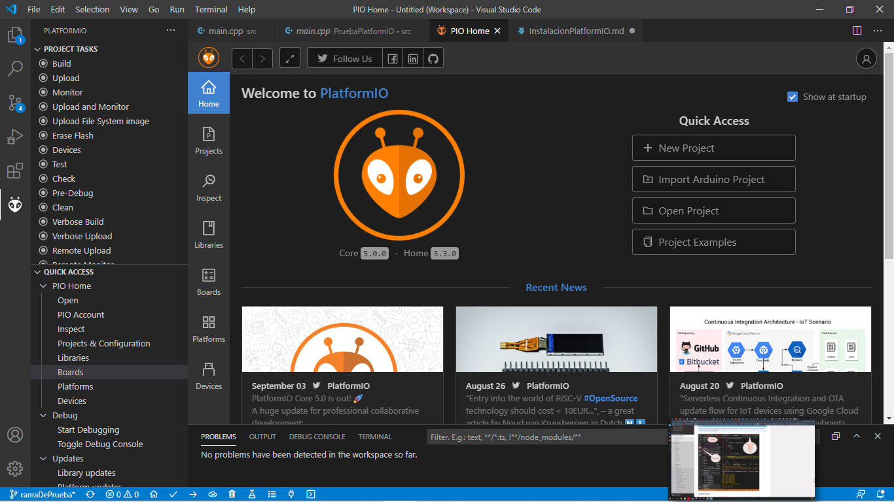
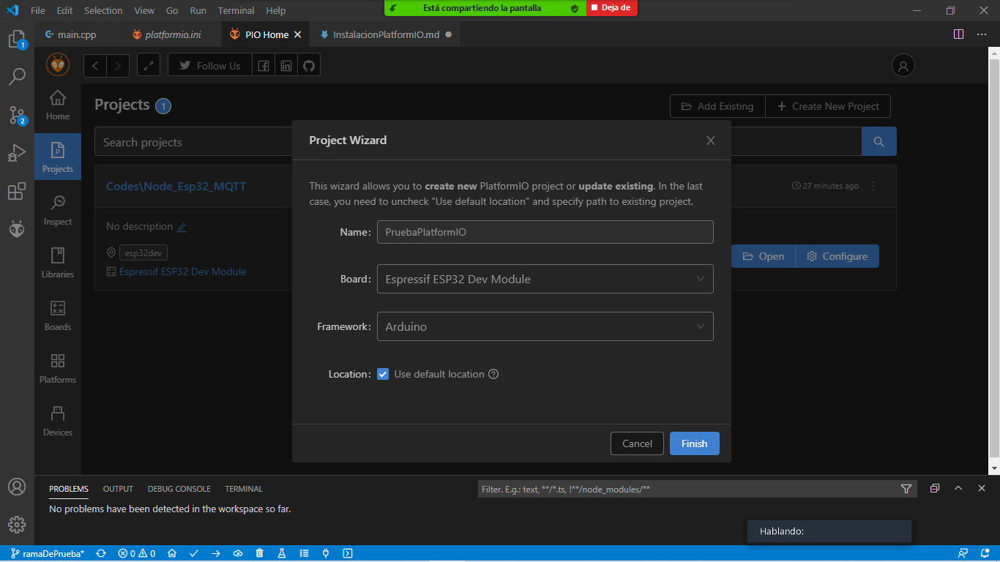
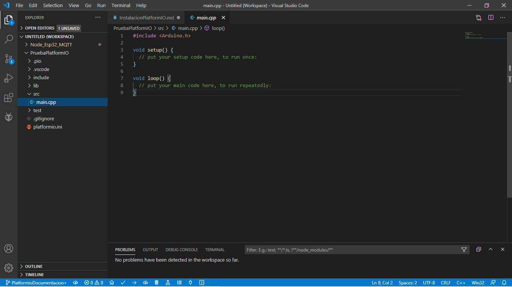
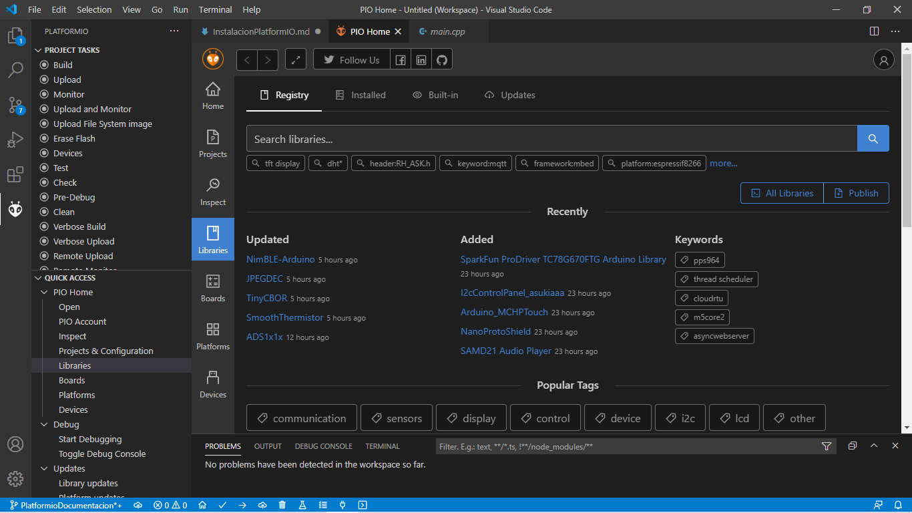

# PlatformIO y Programacion

PlatformIO es un IDE que nos permitira programar microcontroladores tales como Arduino, Esp32, etc, en VisualStudioCode

***

## Instalacion PlatformIO

Pasos para instalar:

- Abrir **Visual Studio**

- Ir a la seccion **Extensions**

- Buscar **PlatformIO IDE** e instalarlo

- Una vez instalado, reiniciar **Visual Studio**

***
## Iniciando PlatformIO

La interfaz de Platformio luce de la siguiente manera, donde tenemos varias secciones como Proyectos, Librerias, etc

***
### Proyectos en PlatformIO IDE

Es importante esta seccion puesto que PlatformIO se encarga de la documentacion necesaria para subir nuestro codigo a los microcontroladores, en simples palabras se encarga de la creacion de todo lo necesario para que nosotros solo programemos en C.



En Board seleccionamos cual microcontrolador utilizaremos, en nuestro caso comenzaremos con el Esp32, al instante en que lo seleccionamos automaticamente el Framework se nos establece como Arduino.
***
*Cabe destacar que tambien podemos añadir Proyectos existentes a nuestro VisualStudio mediante PlatformIO, lo unico que se hace es hacer click en **Add existing project** y buscar la carpeta que contenga dicho proyecto a añadir.*
***

### ¿Donde programar?

Una vez creado nuestro proyecto en platformio se nos abrira una nueva pestaña y a la izquierda veremos la carpeta del proyecto que creamos, en este caso *PruebaPlatformIO*, dentro de dicha carpeta podemos ver que existen las siguientes subcarpetas y archivos:

- .pio
- .vscode
- .include
- .lib
- .src
- .test
- .gitignore
- .platformio.ini

Dentro de *src* encontramos el archivo **main.cpp** el cual es el responsable para codificar el microcontrolador (El lenguaje de programacion es C++).



***

### Librerias

Algo a tener encuenta antes de empezar a programar es que como en todo lenguaje de programacion, hay que considerar las librerias, en Arduino por ejemplo, se utilizan bastantes librerias para poder controlar los sensores u otros elementos

*Por ejemplo si queremos programar un motor Servo se utiliza la libreria **Servo.h** la cual nos permite programar dicho motor*

En el archivo **main.cpp** se puede observar la linea de codigo:
```cpp
#include<Arduino.h>
```
La cual en la interfaz de Arduino IDE no aparece pues el mismo software ya contiene su libreria, en este caso nuestro **main.cpp** contiene dicha libreria porque trabajamos en VisualStudio y necesitamos *Arduino.h* para poder trabajar con funciones y comandos como si estuvieramos utilizando el software de Arduino.

Para añadir librerias utilizando PlatformIO nos tenemos que dirigir al icono de PlatformIO en la barra lateral izquierda, dentro se nos abrira el menu de PlatformIO de lo cual seleccionamos **Libraries**



Podemos buscar la libreria a utilizar en nuestro proyecto, cabe destacar que las librerias se instalan a Proyectos de PlatformIO por lo que es de suma importancia que dichos proyectos esten registrados en PlatformIO, si se añade una carpeta al VisualStudio no significa que sea un *Proyecto* de PlatformIO (Recordar que para añadir un proyecto se debe ir a la seccion **Proyectos**)

***

### Primer Hola Mundo

La programacion en VSCode mediante Platformio y la Interfaz de Arduino sigue siendo la misma, la diferencia radica en que PlatformIO permite mas herramientas de trabajo. En el proyecto que ya hemos creados procederemos a escribir un simple *Hola Mundo* en **main.cpp**

Tenemos la siguiente arquitectura del codigo:

```cpp

#include<Arduino.h>

//Todo lo que siga el doble slash
//es un comentario y no afectara
//al codigo

void setup(){

}

void loop(){

}
```
Dentro de los corchetes de **void setup()** iran todos los comandos y/o codigos que se ejecutaran una vez al iniciar la ejecucion del programa. Por otro lado en **void loop()** iran todas las acciones que se ejecturan mientras este encendido el *Microcontrolador* o el programa este en funcionamiento.

Si queremos imprimir o mostrar un ***"Hola Mundo"*** es necesario establecer una comunicacion **Serial**, ¿Por que? porque controladores con Framework de Arduino se comunican con el ordenador mediante USB lo cual es un elemento de comunicacion Serial, es decir, tenemos que establecer en nuestro programa que comenzara una comunicacion entre nuestro microcontrolador y ordenador (*Para mas informacion buscar en internet Comunicacion Serial Arduino*), para iniciar la comunicacion basta con poner en **void setup()** el siguiente codigo:

```cpp
void setup(){
    Serial.begin(9600);
}
```
Dentro de **begin()** se establecio **9600** lo cual corresponde a la velocidad en que se envian los datos, lo cual se mide en **Baudios**, por defecto muchos sensores se comunican a 9600 Baudios.

Una vez establecida la comunicacion, nos falta agregar la linea de codigo para imprimir un mensaje, podemos ocupar uno de los siguientes codigos:

- print() : Muestra un texto y deja el cursor al final del texto mostrado
- println() : Muestra un texto y deja el cursor en la linea siguiente del texto mostrado

Procedemos a utilizar cualquiera de los dos, en este caso utilizaremos **print()**, si queremos que el mensaje se muestre una sola vez entonces ponemos:

```cpp

void setup(){
    Serial.begin(9600);
    Serila.print("Hola mundo");
}

```
Si queremos que el mensaje se repita o muestra cada cierto tiempo, se trabaja en **void loop()** utilizando el comando **delay()**, cabe mencionar que **Serial.begin(9600)** permanecera en **void setup()** ya que solo establece el tipo de comunicacion.

```cpp
void loop(){
    Serial.print("Hola mundo");
    delay(1000);
}
```
En donde **delay(1000)** apagara o detendra el loop por 1 segundo, finalizado ese segundo volvera a mostrar el *Hola mundo* y asi continuara hasta que un agente externo detenga el programa.
