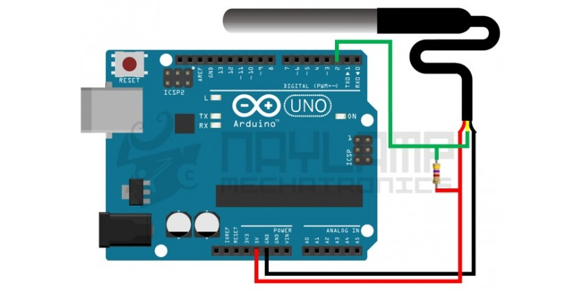

# Instalacion y programacion sensor de temperatura DS18B20

El sensor DS18B20 es un sensor de temperatura impermeable utilizado para medir la temperatura de liquidos, dicho sensor utiliza el protocolo 1-Wire para comunicarse (este protocolo solo necesita un pin de datos para poder comunicarse).


<center>

*Parte sumergible del sensor de temperatura*

</center>

***

## Conexion del sensor 

Para poder tener un voltaje estable e independiente del trafico del bus 1-wire es necesario alimentar Vdd con un voltaje externo, en otras ocasiones se ha considerado tener conectado **VDD** con **GND**, en esta ocasion no se considerara.




***

## Programacion Sensor DS18B20 y comunicacion MQTT


A base de PlatformIO creamos nuestro proyecto a base del **board** "Esp32" con **Framework** de Arduino, luego procedemos a agregar dos librerias importantes para poder utilizar el sensor, las cuales son:

- OneWire.h
- DallasTemperature.h

Para esto nos dirigimos a la seccion de Librerias de PlatformIO, una vez encontrada cada libreria la agregamos al proyecto que hayamos creado.

### Programacion Basica DS18B20

Dentro de la carpeta **src** encontramos el archivo **main.cpp** en el cual utilizaremos el siguiente codigo

```cpp
#include <Arduino.h>
#include <OneWire.h>
#include <DallasTemperature.h>

#define DS18B20_pin 22

OneWire DXensor_Temperature(DS18B20_pin);

DallasTemperature temp(&DXensor_Temperature);


void setup() {
  Serial.begin(9600);
  temp.begin();

}

void loop() {

  temp.requestTemperatures();
  float temperatura = temp.getTempCByIndex(0);

  Serial.print("Temperatura: ");
  Serial.print(temperatura);
  Serial.println(" °C");
  delay(1000);

}
```

Una vez cargado el codigo a nuestro **board**, para ver las mediciones obtenidas por el sensor debemos ir al barra inferior azul de nuestro **Visual Studio** y hacer click en el icono de Monitor Serie.

***

## Comunicacion MQTT con DS18B20

Para poder enviar nuestros datos al MQTT Broker utilizaremos el siguiente codigo

```cpp

/*****************************************
 * Include Libraries
 ****************************************/

#include <Arduino.h>
#include <PubSubClient.h>

#include <DNSServer.h>

#ifdef ESP32
#include <WiFi.h>
#elif defined(ESP8266)
#include <ESP8266WiFi.h>
#endif

/*****************************************
 * Include Sensor Humedity
 ****************************************/

#include <OneWire.h>
#include <DallasTemperature.h>

#define DS18B20_pin 22

OneWire DXensor_Temperature(DS18B20_pin);

DallasTemperature temp(&DXensor_Temperature);


//Constant to connect to the MQTT broker
const char *mqtt_address = "";
int mqtt_port = 1883;
//Constant to login
const char *mqtt_user = "";
const char *mqtt_pass = "";

//To choose topic
const char *subscribe = "";
const char *publish = "";

//To connect to wifi
const char* wifi_ssid = "";
const char* password = "";


char topic[150];
char payload[50];
String clientMac = "";
unsigned char mac[6];

struct Config {
   /* data */
  char name[20];
  bool enabled;
  int hour;
} config;


/****************************************
 * Initialize a global instance
 ****************************************/
WiFiClient espClient;
PubSubClient client(espClient);

char msg_c[60];

//wifi connection
void W_setup(){
      delay(10);
      Serial.println();
      Serial.print("Connecting to SSID: ");
      Serial.println(wifi_ssid);

      WiFi.begin(wifi_ssid,password);

      while (WiFi.status() != WL_CONNECTED){
        delay(750);
        Serial.print("#");
      }
      
      Serial.println("");
      Serial.println("Connecting to WiFi network");
      Serial.println("IP Address: ");
      Serial.println(WiFi.localIP());
}

//this function is called when a new message arrive at the client
void callback(char* topic, byte* payload, unsigned int  long length){
      String msg_in = "";
      Serial.print(topic);
      Serial.println("");
      for( unsigned int long i=0; i<length; i++){
        msg_in += (char)payload[i];
      }
      msg_in.trim();
      Serial.println("Message:" + msg_in);
}


void setup() {
  //Setup of Wifi
  Serial.begin(9600);
  W_setup();

  //Configuration for Client
  client.setServer(mqtt_address,mqtt_port);
  client.setCallback(callback);
  dht.begin();
}
//Reconnect function
void reconnect(){
      while(!client.connected()){
        Serial.print("Connecting to MQTT");
        String Id = ""; //Choose your Id
        Id += String(random(0xffff),HEX);
        //The line above helps us to change the id if
        //there is another client with the same, just
        //adding a number next to it, we use 0xffff HEX = 65535 Dec

        if (client.connect(Id.c_str(),mqtt_user,mqtt_pass)){
          Serial.println("Connected");
            if(client.subscribe(subscribe)){
              Serial.println("Subscription Established");
            } else {
              Serial.println("Subscription Failed");
            }
          } else {
            Serial.print("Failed");
            Serial.print(client.state());
            Serial.println("Trying to reconnecting..");
            delay(3000);
          }
      }

}
//Here we put what we want to do..
void loop() {
  if (client.connected()){
    //What we want to send
    //Example
    String str = "Temperature: "+String(temperature())+" C";
    str.toCharArray(msg_c,25);
    client.publish(subscribe,msg_c);
    delay(1000);
  }

  else {
    //In the opposite case we call the Reconnect function.
    reconnect();

  }
}

int temperature(){
    temp.requestTemperatures();
    float t = temp.getTempCByIndex(0);
    delay(100);
    return t;
}
```