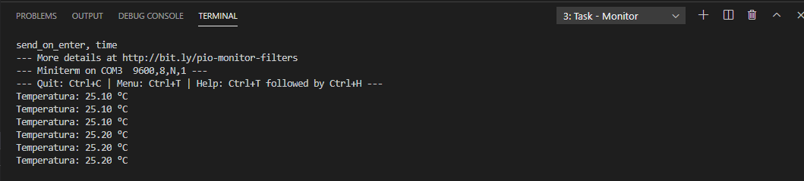

# Instalacion y Codificacion Sensor de Temperatura DHT11
<center>


</center>
El sensor DHT11 nos permite medir la temperatura y humedad ambiental, su conexion se ilustra en la siguiente manera

***
<center>


</center>

*Ilustracion obtenida de: **DHT11 Humidity & Temperature Sensor***

*En la primera imagen la cual aparece el sensor fisico*
***

Donde MCU puede ser un Arduino o Esp32, entre otros, el primer pin va conectado a la alimentacion Vdd que por lo general son **+5 V** que otorga el microcontrolador o alguna fuente externa, el 2 Pin va conectado con una resistencia de **5k OHM** (*Se le conoce como Resistencia Pull Up, dicha conexion permite una comunicacion estable, para longitudes menores a 20 metros se recomienda usar 5K OHM y para longitudes mayores se debe buscar una resistencia adecuada*) y a la vez conectado a un puerto **Digital** del Microcontrolador; por ultimo el 4 pin o ultimo pin va conectado a **GND** (*Tierra*)

Un ejemplo de conexion se ve ilustrado en la siguiente figura:

***
<center>


</center>

*En esta ocasion se utilizo una resistencia de 10 K OHM para el Pull Up y tenemos un pin sobrante, esto ocurre pues el Sensor como tal viene soldado a una placa PCB donde el pin 3 y 4 se comportan como 1 solo, tal como la imagen al inicio de este documento.*

***

## Codificacion DHT11 en PlatformIO

Debemos tener encuenta los siguientes pasos:

- Tener instalado PlatformIO
- Haber creado nuestro proyecto
- Agregar la libreria **DHT.h** de Adafruit a nuestro proyecto creado (Recomendado instalar las dos librerias disponibles)

<center>


</center>

***
En el caso de que la libreria añadida desde platformio no se instale bien y provoque algun error, se recomienda instalarlo mediante la terminal escribiendo

```
#Usando ID de la libreria
> platformio lib install 31

#Usando el nombre de la libreria
> platformio lib install "Adafruit Unified Sensor"

#Instalar version especifica
> platformio lib install 31@1.1.4
> platformio lib install "Adafruit Unified Sensor@1.1.4"

```
Con cualquiera de los comandos mencionados podremos instalar nuestra libreria:

<center>


</center>

***
Una vez hecho esto nos vamos a nuestro archivo **main.cpp** en la carpeta **src**

Tendremos el siguiente codigo:

```cpp
#include<Arduino.h>

void setup(){

}

void loop(){

}
```
Añadiendo la libreria **DHT.h** mediante:

```cpp
#include<DHT.h>
```

Dicha libreria nos permitira ocupar los comandos:

- readHumidity() : Lee la humedad relativa
- readTemperature() : Lee la temperatura en grados Centigrados (por defecto)
- readTemperature(True) : Lee la temperatura en grados Fahrenheit

Ya añadida la libreria debemos inicializar nuestro sensor de la siguiente manera:

```cpp
#include<Arduino.h>
#include<DHT.h>

//Establecemos el sensor DHT a utilizar y el puerto a ocupar
//dht(puerto, tipo de sensor)
#define DHTPIN 22

DHT dht(DHTPIN, DHT11);

void setup(){
    Serial.begin(9600); //Establecemos la comunicacion
    dht.begin(); //Iniciamos el sensor
}

void loop(){
    float t = readTemperature();
    print("Temperatura");
    print(t);
    println("°C");
    delay(2000);
}
```

Establecimos **float t** pues **t** sera nuestra variable de temperatura y al declararla float podremos obtener mayor precision ya que sera de tipo *Decimal*.

Para subir el archivo al microcontrolador presionamos aca:

<center>


</center>

Para poder observar los datos que recoge debemos abrir el monitor serie en PlatformIO, para eso nos dirigimos a la barra de abajo:

<center>


</center>

Y obtendremos los siguientes resultados:



Si queremos leer la humedad, simplemente creamos otra variable (el nombre no importa) y usamos el comando para leer humedad, un ejemplo:

```cpp
float h = readHumidity();
```
Y para mostrar el valor que se detecte utilizamos:

```cpp
print(h);
```

***

# Comunicacion DHT11 a MQTT Broker

En esta seccion se utilizara un codigo pre-hecho para poder enviar los datos que se detecten mediante el sensor DHT11 (temperatura y humedad), no explicaremos el ¿Por qué? del siguiente codigo:

```cpp
#include <Arduino.h>
#include <PubSubClient.h>
#include <WiFi.h>

//Establecemos la direccion MQTT y su puerto
const char *mqtt_address = "";
int mqtt_port = 1883;

//Ingresamos nuestro usuario y contraseña
const char *mqtt_user = "";
const char *mqtt_pass = "";

//Elegimos el Topic a publicar y subscribir
const char *subscribe = "";
const char *publish = "";

//Establecemos la red WIFI a conectar y su contraseña
const char* wifi_ssid = "";
const char* password = "";

//Configuracion wifi, establecemos que el microcontrolador
//sera un Publisher (mayor informacion buscar MQTT publisher)
WiFiClient espClient;
PubSubClient client(espClient);

char msg_c[60];

//Funcion que permite la conexion al WIFI
void W_setup(){
      delay(10);
      Serial.println();
      Serial.print("Connecting to SSID: ");
      Serial.println(wifi_ssid);

      WiFi.begin(wifi_ssid,password);

      while (WiFi.status() != WL_CONNECTED){
        delay(750);
        Serial.print("#");
      }
      
      Serial.println("");
      Serial.println("Connecting to WiFi network");
      Serial.println("IP Address: ");
      Serial.println(WiFi.localIP());
}

void callback(char* topic, byte* payload, unsigned int length){
      String msg_in = "";
      Serial.print(topic);
      Serial.println("");
      for(int i=0; i<length; i++){
        msg_in += (char)payload[i];
      }
      msg_in.trim();
      Serial.println("Message:" + msg_in);
}

void setup() {
  //Establecemos los baudios para comunicar
  //Y tambien iniciamos la funcion W_setup()
  //la cual es la responsable de comunicarse al wifi
  //dicha funcion esta escrita mas arriba
  Serial.begin(9600);
  W_setup();

  //Permite la comunicacion con el MQTT broker
  client.setServer(mqtt_address,mqtt_port);
  client.setCallback(callback);
  
}
//Funcion para Reconectar
void reconnect(){
      while(!client.connected()){
        Serial.print("Connecting to MQTT");
        String Id = "DX Temperature"; //Elige tu Id
        Id += String(random(0xffff),HEX);
        //Agregamos random(0xffff) en hexadecimal
        //para que en el caso de ID repetidos
        //se le agregue un numero  

        if (client.connect(Id.c_str(),mqtt_user,mqtt_pass)){
          Serial.println("Connected");
            if(client.subscribe(subscribe)){
              Serial.println("Subscription Established");
            } else {
              Serial.println("Subscription Failed");
            }
          } else {
            Serial.print("Failed");
            Serial.print(client.state());
            Serial.println("Trying to reconnecting..");
            delay(3000);
          }
      }

}

void loop() {
  if (client.connected()){
    
    String str = "mensaje bla bla"+String();
    str.toCharArray(msg_c,25);
    client.publish(subscribe,msg_c);
    delay(1000);
  }

  else {
    reconnect();

  }
}
```
***
## DHT11 Temperatura

En este codigo crearemos una funcion tipo retorno para poder leer la temperatura, no olvidar agregar la liberria **DHT.h**, entonces tenemos:

```cpp

float temperature(){
    float t = readTemperature();
    delay(2000);
    return t;
}

```
No olvidar tener inicializado el DHT, es decir establecer el modelo y su puerto, esto se hace al inicio, antes de las funciones y despues de las librerias
```cpp
#define DHTPIN 22

DHT dht(DHTPIN, DHT11);
```
Luego en **void setup();** inicializamos el sensor usando **dht.begin();**

```cpp
void setup() {
  //Establecemos los baudios para comunicar
  //Y tambien iniciamos la funcion W_setup()
  //la cual es la responsable de comunicarse al wifi
  //dicha funcion esta escrita mas arriba
  Serial.begin(9600);
  W_setup();

  //Permite la comunicacion con el MQTT broker
  client.setServer(mqtt_address,mqtt_port);
  client.setCallback(callback);
  
  dht.begin();
}
```

Agregamos la funcion al codigo por debajo de la funcion **void loop()**  (no dentro, sino que por debajo) y alteramos la siguiente linea:

```cpp
  if (client.connected()){
    
    String str = "mensaje bla bla"+String();
    str.toCharArray(msg_c,25);
    client.publish(subscribe,msg_c);
    delay(1000);
  }
```
Lo dejamos como:

```cpp

  if (client.connected()){
    
    String str = "Temperatura: "+String(temperature())+" °C";
    str.toCharArray(msg_c,25);
    client.publish(subscribe,msg_c);
    delay(1000);
  }

```

Entonces el codigo final nos deberia quedar como:

```cpp

#include <Arduino.h>
#include <PubSubClient.h>
#include <WiFi.h>
#include <DHT.h>

//Establecemos la direccion MQTT y su puerto
const char *mqtt_address = "";
int mqtt_port = 1883;

//Ingresamos nuestro usuario y contraseña
const char *mqtt_user = "";
const char *mqtt_pass = "";

//Elegimos el Topic a publicar y subscribir
const char *subscribe = "";
const char *publish = "";

//Establecemos la red WIFI a conectar y su contraseña
const char* wifi_ssid = "";
const char* password = "";


//----------DHT11--------------------------

#define DHTPIN 22
DHT dht(DHTPIN, DHT11);

//---------------------------------

//Configuracion wifi, establecemos que el microcontrolador
//sera un Publisher (mayor informacion buscar MQTT publisher)
WiFiClient espClient;
PubSubClient client(espClient);

char msg_c[60];

//Funcion que permite la conexion al WIFI
void W_setup(){
      delay(10);
      Serial.println();
      Serial.print("Connecting to SSID: ");
      Serial.println(wifi_ssid);

      WiFi.begin(wifi_ssid,password);

      while (WiFi.status() != WL_CONNECTED){
        delay(750);
        Serial.print("#");
      }
      
      Serial.println("");
      Serial.println("Connecting to WiFi network");
      Serial.println("IP Address: ");
      Serial.println(WiFi.localIP());
}

void callback(char* topic, byte* payload, unsigned int length){
      String msg_in = "";
      Serial.print(topic);
      Serial.println("");
      for(int i=0; i<length; i++){
        msg_in += (char)payload[i];
      }
      msg_in.trim();
      Serial.println("Message:" + msg_in);
}

void setup() {
  //Establecemos los baudios para comunicar
  //Y tambien iniciamos la funcion W_setup()
  //la cual es la responsable de comunicarse al wifi
  //dicha funcion esta escrita mas arriba
  Serial.begin(9600);
  W_setup();

  //Permite la comunicacion con el MQTT broker
  client.setServer(mqtt_address,mqtt_port);
  client.setCallback(callback);
  
  dht.begin();
}
//Funcion para Reconectar
void reconnect(){
      while(!client.connected()){
        Serial.print("Connecting to MQTT");
        String Id = "DX Temperature"; //Elige una Id
        Id += String(random(0xffff),HEX);
        //Agregamos random(0xffff) en hexadecimal
        //para que en el caso de ID repetidos
        //se le agregue un numero  

        if (client.connect(Id.c_str(),mqtt_user,mqtt_pass)){
          Serial.println("Connected");
            if(client.subscribe(subscribe)){
              Serial.println("Subscription Established");
            } else {
              Serial.println("Subscription Failed");
            }
          } else {
            Serial.print("Failed");
            Serial.print(client.state());
            Serial.println("Trying to reconnecting..");
            delay(3000);
          }
      }

}

void loop() {
  if (client.connected()){
    //dentro de String() ponemos la funcion de retorno
    //que hemos creado, ya que contiene el valor de
    //la variable a medir
    String str = "Temperatura: "+String(temperature())+" °C";
    str.toCharArray(msg_c,25);
    client.publish(subscribe,msg_c);
    delay(1000);
  }

  else {
    reconnect();

  }
}

float temperature(){
    float t = readTemperature();
    delay(2000);
    return t;
}
```
***
## DHT11 Humedad

Hay que tener en cuenta que este codigo es similar al de temperatura, lo unico que alteraremos sera la funcion tipo retorno de temperatura, la modificaremos y/o reemplazaremos por:

```cpp

float humidity(){
    float h = readHumidity();
    delay(2000);
    return h;
}

```

Entonces nos quedara el codigo de la siguiente manera:

```cpp
#include <Arduino.h>
#include <PubSubClient.h>
#include <WiFi.h>
#include <DHT.h>

//Establecemos la direccion MQTT y su puerto
const char *mqtt_address = "";
int mqtt_port = 1883;

//Ingresamos nuestro usuario y contraseña
const char *mqtt_user = "";
const char *mqtt_pass = "";

//Elegimos el Topic a publicar y subscribir
const char *subscribe = "";
const char *publish = "";

//Establecemos la red WIFI a conectar y su contraseña
const char* wifi_ssid = "";
const char* password = "";


//----------DHT11--------------------------

#define DHTPIN 22
DHT dht(DHTPIN, DHT11);

//---------------------------------

//Configuracion wifi, establecemos que el microcontrolador
//sera un Publisher (mayor informacion buscar MQTT publisher)
WiFiClient espClient;
PubSubClient client(espClient);

char msg_c[60];

//Funcion que permite la conexion al WIFI
void W_setup(){
      delay(10);
      Serial.println();
      Serial.print("Connecting to SSID: ");
      Serial.println(wifi_ssid);

      WiFi.begin(wifi_ssid,password);

      while (WiFi.status() != WL_CONNECTED){
        delay(750);
        Serial.print("#");
      }
      
      Serial.println("");
      Serial.println("Connecting to WiFi network");
      Serial.println("IP Address: ");
      Serial.println(WiFi.localIP());
}

void callback(char* topic, byte* payload, unsigned int length){
      String msg_in = "";
      Serial.print(topic);
      Serial.println("");
      for(int i=0; i<length; i++){
        msg_in += (char)payload[i];
      }
      msg_in.trim();
      Serial.println("Message:" + msg_in);
}

void setup() {
  //Establecemos los baudios para comunicar
  //Y tambien iniciamos la funcion W_setup()
  //la cual es la responsable de comunicarse al wifi
  //dicha funcion esta escrita mas arriba
  Serial.begin(9600);
  W_setup();

  //Permite la comunicacion con el MQTT broker
  client.setServer(mqtt_address,mqtt_port);
  client.setCallback(callback);
  
  dht.begin();
}
//Funcion para Reconectar
void reconnect(){
      while(!client.connected()){
        Serial.print("Connecting to MQTT");
        String Id = "DX Humidity"; //Elige una ID
        Id += String(random(0xffff),HEX);
        //Agregamos random(0xffff) en hexadecimal
        //para que en el caso de ID repetidos
        //se le agregue un numero  

        if (client.connect(Id.c_str(),mqtt_user,mqtt_pass)){
          Serial.println("Connected");
            if(client.subscribe(subscribe)){
              Serial.println("Subscription Established");
            } else {
              Serial.println("Subscription Failed");
            }
          } else {
            Serial.print("Failed");
            Serial.print(client.state());
            Serial.println("Trying to reconnecting..");
            delay(3000);
          }
      }

}

void loop() {
  if (client.connected()){
    //dentro de String() ponemos la funcion de retorno
    //que hemos creado, ya que contiene el valor de
    //la variable a medir
    String str = "Humedad Relativa: "+String(humidity());
    str.toCharArray(msg_c,25);
    client.publish(subscribe,msg_c);
    delay(1000);
  }

  else {
    reconnect();

  }
}

float humidity(){
    float h = readHumidity();
    delay(2000);
    return h;
}
```

***
## Consideraciones sobre MQTT
Cabe destacar que las siguientes constantes definidas en el programa varian dependiendo del usuario, es decir, varia el WIFI a utilizar al igual que el MQTT Broker al que se dirige la informacion.

- mqtt_address
- mqtt_port
- mqtt_user
- mqtt_pass
- subscribe
- publish
- wifi_ssid
- password


