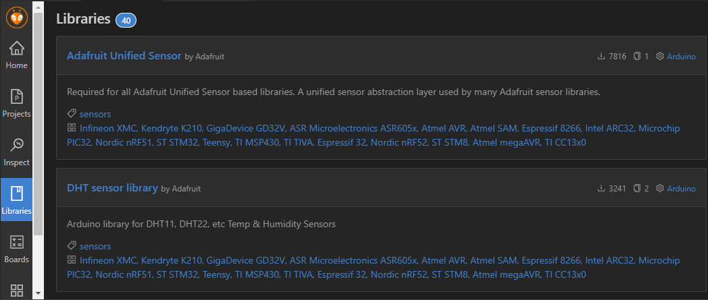

# Instalacion y Codificacion Sensor de Temperatura DHT11


El sensor DHT11 nos permite medir la temperatura y humedad ambiental, su conexion se ilustra en la siguiente manera

***


*Ilustracion obtenida de: **DHT11 Humidity & Temperature Sensor***

***

Donde MCU puede ser un Arduino o Esp32, entre otros, el primer pin va conectado a la alimentacion Vdd que por lo general son **+5 V** que otorga el microcontrolador o alguna fuente externa, el 2 Pin va conectado con una resistencia de **5k OHM** (*Se le conoce como Resistencia Pull Up, dicha conexion permite una comunicacion estable, para longitudes menores a 20 metros se recomienda usar 5K OHM y para longitudes mayores se debe buscar una resistencia adecuada*) y a la vez conectado a un puerto **Digital** del Microcontrolador; por ultimo el 4 pin o ultimo pin va conectado a **GND** (*Tierra*)

Un ejemplo de conexion se ve ilustrado en la siguiente figura:

***


*En esta ocasion se utilizo una resistencia de 10 K OHM para el Pull Up y tenemos un pin sobrante, esto ocurre pues el Sensor como tal viene soldado a una placa PCB donde el pin 3 y 4 se comportan como 1 solo, tal como la imagen al inicio de este documento.*

***

## Codificacion DHT11 en PlatformIO

Debemos tener encuenta los siguientes pasos:

- Tener instalado PlatformIO
- Haber creado nuestro proyecto
- Agregar la libreria **DHT.h** de Adafruit a nuestro proyecto creado (Recomendado instalar las dos librerias disponibles)
  


***
En el caso de que la libreria añadida desde platformio no se instale bien y provoque algun error, se recomienda instalarlo mediante la terminal escribiendo

```
#Usando ID de la libreria
> platformio lib install 31

#Usando el nombre de la libreria
> platformio lib install "Adafruit Unified Sensor"

#Instalar version especifica
> platformio lib install 31@1.1.4
> platformio lib install "Adafruit Unified Sensor@1.1.4"

```
Con cualquiera de los comandos mencionados podremos instalar nuestra libreria:


***
Una vez hecho esto nos vamos a nuestro archivo **main.cpp** en la carpeta **src**

Tendremos el siguiente codigo:

```cpp
#include<Arduino.h>

void setup(){

}

void loop(){

}
```
Añadiendo la libreria **DHT.h** mediante:

```cpp
#include<DHT.h>
```

Dicha libreria nos permitira ocupar los comandos:

- readHumidity() : Lee la humedad relativa
- readTemperature() : Lee la temperatura en grados Centigrados (por defecto)
- readTemperature(True) : Lee la temperatura en grados Fahrenheit

Ya añadida la libreria debemos inicializar nuestro sensor de la siguiente manera:

```cpp
#include<Arduino.h>
#include<DHT.h>

//Establecemos el sensor DHT a utilizar y el puerto a ocupar
//dht(puerto, tipo de sensor)
#define DHTPIN 22

DHT dht(DHTPIN, DHT11);

void setup(){
    Serial.begin(9600); //Establecemos la comunicacion
    dht.begin(); //Iniciamos el sensor
}

void loop(){
    float t = readTemperature();
    print("Temperatura");
    print(t);
    println("°C");
    delay(2000);
}
```

Establecimos **float t** pues **t** sera nuestra variable de temperatura y al declararla float podremos obtener mayor precision ya que sera de tipo *Decimal*

Para poder observar los datos que recoge debemos abrir el monitor serie en PlatformIO, para eso nos dirigimos a la barra de abajo:

